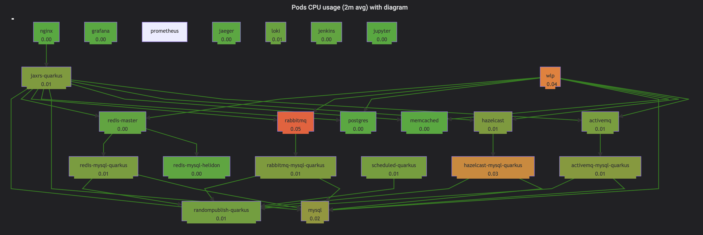

# k8s-3tier-webapp


  
[](https://travis-ci.com/yurake/k8s-3tier-webapp)
[](https://sonarcloud.io/dashboard?id=yurake_webapp-service)
[](https://codecov.io/gh/yurake/k8s-3tier-webapp)
[](LICENSE)

## About
Sample web application based on k8s.  
Focus on connecting components, setting k8s resources, and aiming to microservices.  
The k8s-3tier-webapp service is for PoC, not production ready.

| Tier | Name | Description |
|:-:|:-:|:-:|
| 1 | Frontend | Web page, Application logic, Static file
| 2 | Backend | Database, Cache, Messaging
| 3 | Management | Monitoring, CI/CD, Tracing




## Requirements
Installed CLI commands.
* docker
* kubectl
* minikube

## Run on Minikube

For Mac  
```bash
minikube config set memory 8192
minikube config set cpus 4
minikube config set disk-size 80g
minikube start --extra-config=kubelet.authentication-token-webhook=true --extra-config=kubelet.authorization-mode=Webhook --kubernetes-version=v1.15.4

minikube addons enable ingress

eval $(minikube docker-env)
```

For Windows  
```bash
minikube config set memory 8192
minikube config set cpus 4
minikube config set disk-size 80g
minikube start --extra-config=kubelet.authentication-token-webhook=true --extra-config=kubelet.authorization-mode=Webhook --kubernetes-version=v1.15.4

minikube addons enable ingress

minikube docker-env --shell powershell | Invoke-Expression
```

## Build & Apply

`install.sh` supports `docker build`, `kubectl apply` to k8s clusters.
```
./install.sh
```

## Web Console Access

### Add hosts
Add IP, domain in /etc/hosts
```
echo `minikube ip` k8s.3tier.webapp wlp.minikube api.server.minikube rabbitmq.management.minikube jenkins.minikube alertmanager.minikube prometheus.minikube grafana.minikube jupyter.minikube hazelcast.manager.minikube activemq.management.minikube jaeger.minikube argo.minikube >> /etc/hosts
```

#### Web Console list
* Top Page  
http://k8s.3tier.webapp/


* Open Liberty  
http://wlp.minikube  
* Rabbitmq Management Console  
http://rabbitmq.management.minikube  
* Activemq Management Console  
http://activemq.management.minikube  

## See Also
Set up [monitoring](kubernetes/monitoring/README.md)

## Github Actions on minikube [alpha]
  
The workflow for end to end api test on minikube on Github Actions.  
The trriger is close issue.
