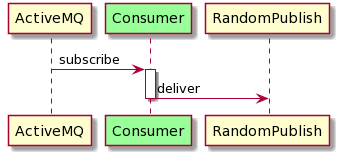
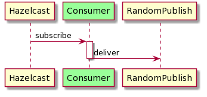
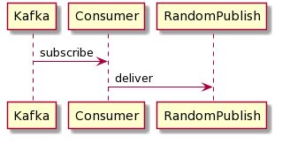
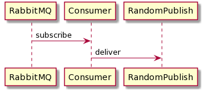
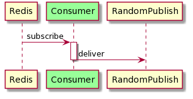
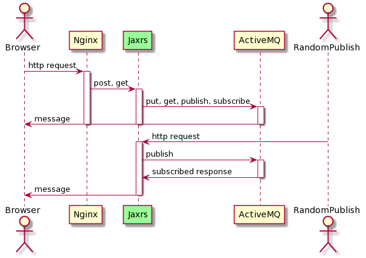
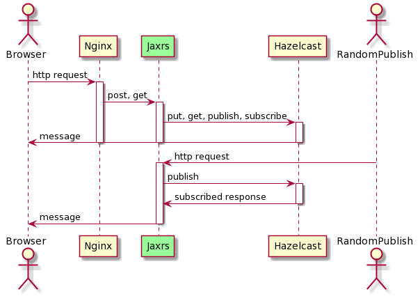
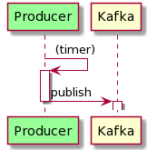
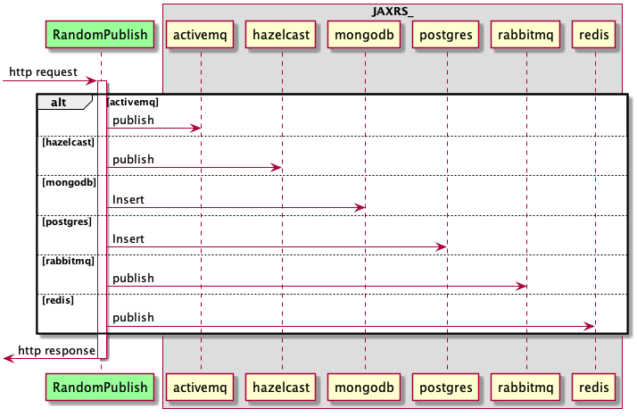
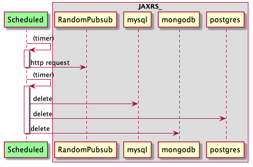

# 🦌 application

## consumer-activemq-quarkus

\\

## consumer-hazelcast-quarkus

\\

## consumer-kafka-quarkus

\\

## consumer-rabbitmq-quarkus

\\

## consumer-redis-quarkus

\\

## jaxrs-activemq-quarkus

\\

## jaxrs-hazelcast-quarkus

\\

## jaxrs-kafka-quarkus

## jaxrs-memcached-quarkus

## jaxrs-mongodb-quarkus

## jaxrs-cassandra-quarkus

## jaxrs-mysql-quarkus

## jaxrs-postgres-quarkus

## jaxrs-rabbitmq-quarkus

## jaxrs-redis-quarkus

## producer-kafka-quarkus

\\

## randompublish-quarkus

\\

## scheduled-quarkus

\\

## webapp-service
